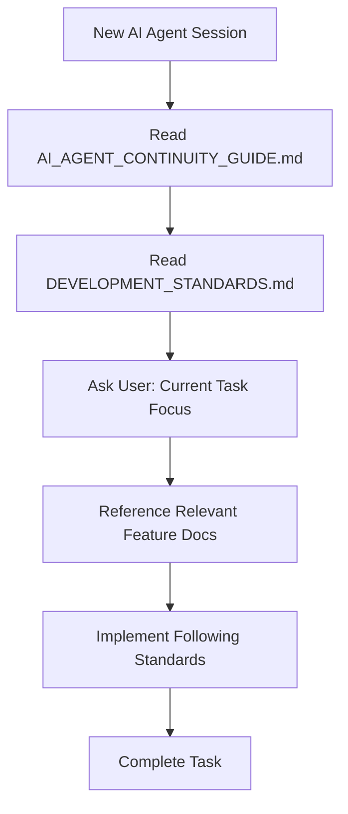

# 🤖 AI Agent Continuity Guide - JA-CMS

## 🎯 **PURPOSE**

Panduan ini memastikan **setiap AI agent** (Cursor AI, Claude, ChatGPT, dll) dapat **langsung memahami context project** dan melanjutkan development **tanpa harus membaca ulang** semua dokumentasi.

---

## 📋 **QUICK PROJECT CONTEXT**

### **🏗️ Project Overview:**
- **Name**: JA-CMS (Enterprise Content Management System)
- **Architecture**: Full-stack TypeScript (Next.js + Express.js + PostgreSQL)
- **UI Framework**: ShadCN/UI + Tailwind CSS (Neutral Theme)
- **Status**: **Documentation 100% Complete** - Ready for development implementation

### **📊 Current Project State:**
- **Documentation**: ✅ **100% Complete** (65+ feature files, 9 categories)
- **Database**: ✅ Schema designed (200+ tables)
- **API**: ✅ Specifications ready (500+ endpoints)
- **UI**: ✅ Component designs ready (36+ components)
- **Development**: 🔄 **Implementation Phase** (following documentation)

---

## 📚 **ESSENTIAL DOCUMENTATION HIERARCHY**

### **🚨 CRITICAL - Must Read First:**
1. **[CURRENT_TODOS.md](./CURRENT_TODOS.md)** - **CURRENT PROGRESS & NEXT STEPS**
   - Current project status and completed tasks
   - Immediate next steps and priorities
   - Quick start commands and credentials
2. **[DEVELOPMENT_STANDARDS.md](./DEVELOPMENT_STANDARDS.md)** - **WAJIB DIBACA PERTAMA**
   - Language rules (English UI, Indonesian comments)
   - Project structure, naming conventions
   - Technical implementation standards

### **🔧 TECHNICAL IMPLEMENTATION:**
2. **[API_INTEGRATION_GUIDE.md](./API_INTEGRATION_GUIDE.md)** - API integration patterns
3. **[features/README.md](./features/README.md)** - Master feature index (9 categories)

### **📊 FEATURE SPECIFICATIONS (Reference Only):**
4. **[features/](./features/)** - 65+ detailed feature files
   - `01_analytics/` - Analytics system (6 files)
   - `02_content/` - Content management (7 files)
   - `03_media/` - Media management (8 files)
   - `04_themes/` - Theme system (7 files)
   - `05_users/` - User management (7 files)
   - `06_security/` - Security system (6 files)
   - `07_system/` - System management (7 files)
   - `08_tools/` - Tools & utilities (4 files)
   - `09_extensions/` - Extensions system (4 files)

---

## ⚡ **INSTANT AI AGENT ONBOARDING**

### **🤖 For New AI Agent Sessions:**

**Step 1: Read Core Rules (30 seconds)**
```
READ: docs/development/DEVELOPMENT_STANDARDS.md (WAJIB - contains all coding rules)
```

**Step 2: Understand Current Context**
```
CONTEXT: Project documentation 100% complete, implementation phase active
FOCUS: Follow existing specifications, don't recreate documentation
```

**Step 3: Check Current Task**
```
ASK USER: "What specific feature/component should I work on?"
REFERENCE: Use docs/development/features/ for specifications
```

---

## 🎯 **AI AGENT BEHAVIOR GUIDELINES**

### **✅ DO (WAJIB):**
1. **Always follow DEVELOPMENT_STANDARDS.md** - No exceptions
2. **Use existing feature specifications** from `docs/development/features/`
3. **Implement according to documented schemas** (database, API, UI)
4. **Ask specific questions** about current task focus
5. **Reference existing documentation** instead of creating new ones

### **❌ DON'T (DILARANG):**
1. **Don't recreate documentation** - It's already 100% complete
2. **Don't ignore language rules** - English UI, Indonesian comments
3. **Don't deviate from project structure** - Follow established patterns
4. **Don't ask to read all docs** - Use this guide for quick context
5. **Don't create conflicting standards** - Follow existing ones

---

## 🚀 **DEVELOPMENT WORKFLOW**

### **🔄 Typical AI Agent Session Flow:**



### **📋 Task-Specific References:**

**Frontend Development:**
- Standards: `DEVELOPMENT_STANDARDS.md` (Components, UI, ShadCN/UI)
- Style Guidelines: `DEVELOPMENT_STANDARDS.md` (Neutral Flat Clean Design Standards)
- API Integration: `API_INTEGRATION_GUIDE.md`
- Feature Specs: `features/[category]/[feature].md`

**Backend Development:**
- Standards: `DEVELOPMENT_STANDARDS.md` (API, Database, Security)
- Feature Specs: `features/[category]/[feature].md` (Database schemas, API endpoints)

**Database Work:**
- Standards: `DEVELOPMENT_STANDARDS.md` (Database section)
- Schemas: `features/[category]/[feature].md` (Database schemas section)

**Schema & Database Management:**
- **Schema Files**: Update `backend/prisma/schemas/[category].prisma` (NOT main schema.prisma)
- **Seeder Files**: Update `backend/prisma/seeders/[category].ts` (NOT main seeder)
- **Merge Process**: Run `backend/prisma/scripts/merge-schemas.js` to combine schema files
- **Database Sync**: After schema changes, run `npx prisma generate` and `npx prisma db push`
- **Seeder Execution**: Run `npm run db:seed` to populate database with sample data

---

## 📊 **PROJECT STATUS TRACKING**

### **🏆 Completed (100%):**
- ✅ **Documentation Architecture** - All feature specifications complete
- ✅ **Database Design** - 200+ table schemas documented
- ✅ **API Specifications** - 500+ endpoint specifications
- ✅ **UI/UX Design** - 36+ component specifications
- ✅ **Development Standards** - Complete coding guidelines

### **🔄 Current Phase:**
- **Implementation Phase** - Converting documentation to working code
- **Focus**: Follow existing specifications, don't recreate documentation

### **📋 Implementation Priority:**
1. **Database Setup** - Implement documented schemas
2. **Backend API** - Implement documented endpoints
3. **Frontend Components** - Implement documented UI designs
4. **Integration** - Connect frontend-backend following API guide

---

## 🤝 **AI AGENT COLLABORATION**

### **🔄 Session Handoff Protocol:**

**When Starting New Session:**
1. Read this guide (2 minutes)
2. Read DEVELOPMENT_STANDARDS.md (5 minutes)
3. Ask user about current focus
4. Reference specific feature documentation as needed

**When Ending Session:**
1. Document current progress in comments
2. Note any specific context for next agent
3. Update implementation status if significant progress made

### **📝 Context Preservation:**

**In Code Comments:**
```typescript
/**
 * Status: Implementasi sesuai docs/development/features/02_content/posts.md
 * Progress: Database schema complete, API endpoints in progress
 * Next: Implement frontend components
 */
```

**In Commit Messages:**
```
feat: implement posts API following content management specs
- Implemented POST /api/posts endpoint
- Following docs/development/features/02_content/posts.md
- Database schema matches documented design
```

---

## 🎯 **COMMON AI AGENT SCENARIOS**

### **Scenario 1: "Help me implement user management"**
**AI Response:**
1. ✅ Reference `docs/development/features/05_users/`
2. ✅ Follow database schemas from `management.md`
3. ✅ Implement API endpoints from specifications
4. ✅ Follow `DEVELOPMENT_STANDARDS.md` for coding style

### **Scenario 2: "Create a new component"**
**AI Response:**
1. ✅ Check if component already specified in feature docs
2. ✅ Follow ShadCN/UI standards from `DEVELOPMENT_STANDARDS.md`
3. ✅ Use neutral theme and proper naming conventions
4. ✅ Implement according to documented UI specifications
5. ✅ Follow Neutral Flat Clean Design standards (neutral colors, minimal shadows, clean layout)
6. ✅ Use proper spacing (space-y-4, gap-4, p-4) and typography hierarchy
7. ✅ JANGAN gunakan warna mencolok, heavy shadows, atau dramatic effects

### **Scenario 3: "Fix this API endpoint"**
**AI Response:**
1. ✅ Reference API specifications in relevant feature docs
2. ✅ Follow API standards from `DEVELOPMENT_STANDARDS.md`
3. ✅ Check `API_INTEGRATION_GUIDE.md` for integration patterns
4. ✅ Maintain consistency with documented endpoints

### **Scenario 4: "Update database schema"**
**AI Response:**
1. ✅ Update specific schema file in `backend/prisma/schemas/[category].prisma`
2. ✅ Run `backend/prisma/scripts/merge-schemas.js` to combine schemas
3. ✅ Run `npx prisma generate` and `npx prisma db push` to sync database
4. ✅ Update corresponding seeder in `backend/prisma/seeders/[category].ts` if needed
5. ✅ Follow database standards from `DEVELOPMENT_STANDARDS.md`

---

## 🚨 **CRITICAL REMINDERS**

### **🔥 ALWAYS REMEMBER:**
1. **Language Rules**: English UI text, Indonesian code comments
2. **No Documentation Recreation**: Use existing 65+ feature files
3. **Follow Specifications**: Don't deviate from documented designs
4. **ShadCN/UI Only**: Use documented component library
5. **Neutral Theme**: Follow documented color scheme
6. **Schema Management**: Update `backend/prisma/schemas/` files, NOT main schema.prisma
7. **Seeder Management**: Update `backend/prisma/seeders/` files, NOT main seeder

### **🎨 NEUTRAL FLAT CLEAN DESIGN RULES (WAJIB):**
8. **Neutral Color Palette**: Gunakan grey/neutral colors, JANGAN warna mencolok
9. **Flat Design**: Minimal shadows (shadow-sm, shadow), JANGAN shadow-xl/2xl
10. **Clean Layout**: Proper spacing (space-y-4, gap-4, p-4), konsisten
11. **Subtle Effects**: Hover effects halus (hover:bg-muted/50), JANGAN dramatic
12. **Typography**: Clean hierarchy (text-sm, text-base, text-lg)
13. **Borders**: Clean borders (border-border), JANGAN tebal/berwarna
14. **No Heavy Effects**: JANGAN gradients, scale, rotate, rounded-2xl/3xl

### **⚠️ RED FLAGS (Stop and Ask):**
- User asks to "recreate documentation"
- User asks to "change language rules"
- User asks to "use different UI framework"
- User asks to "ignore existing specifications"
- User asks to "edit main schema.prisma directly" (should use schemas/ folder)
- User asks to "edit main seeder directly" (should use seeders/ folder)
- User asks to "use colorful design" (should use neutral flat clean)
- User asks to "add heavy shadows/effects" (should use minimal flat design)
- User asks to "use gradients/animations" (should use subtle effects only)

---

## 📞 **QUICK REFERENCE COMMANDS**

### **🔍 When You Need To:**

**Understand Project Structure:**
```bash
READ: docs/development/DEVELOPMENT_STANDARDS.md (Project structure section)
```

**Find Feature Specifications:**
```bash
BROWSE: docs/development/features/README.md (Master index)
THEN: docs/development/features/[category]/[specific-feature].md
```

**Check API Integration:**
```bash
READ: docs/development/API_INTEGRATION_GUIDE.md
```

**Verify Implementation Standards:**
```bash
READ: docs/development/DEVELOPMENT_STANDARDS.md (Specific section)
```

**Check Style Guidelines:**
```bash
READ: docs/development/DEVELOPMENT_STANDARDS.md (Neutral Flat Clean Design Standards section)
```

---

## 🎉 **SUCCESS METRICS**

### **✅ AI Agent Is Successful When:**
- Can start working immediately without re-reading all docs
- Follows established standards consistently
- Implements features according to specifications
- Maintains project consistency across sessions
- Doesn't recreate existing documentation

### **📊 Efficiency Targets:**
- **Onboarding**: < 5 minutes to start productive work
- **Context Switch**: < 2 minutes between different features
- **Consistency**: 100% adherence to established standards
- **Productivity**: Focus on implementation, not documentation recreation

---

**🤖 AI Agent Status: READY FOR CONTINUOUS DEVELOPMENT**

**Last Updated:** January 11, 2025  
**Version:** 1.2.0  
**Purpose:** AI Agent Continuity & Context Preservation  
**Maintainer:** JA-CMS Development Team
