# 🏗️ Architecture Diagrams

> **Diagram Arsitektur Sistem JA-CMS**  
> Visual representation of system architecture for each feature category

---

## 📋 **Overview**

Dokumen ini menyediakan diagram arsitektur visual untuk setiap kategori fitur dalam JA-CMS. Setiap diagram menunjukkan flow data, komponen utama, dan interaksi antar sistem untuk memudahkan pemahaman dan development.

---

## 📊 **1. Analytics System Architecture**

### **Analytics Data Flow:**

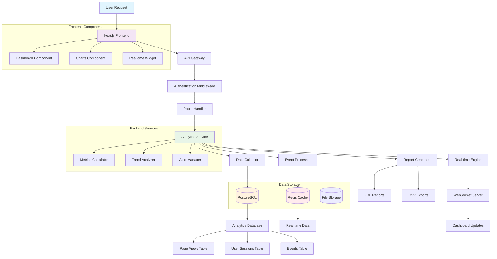

### **Real-time Analytics Flow:**

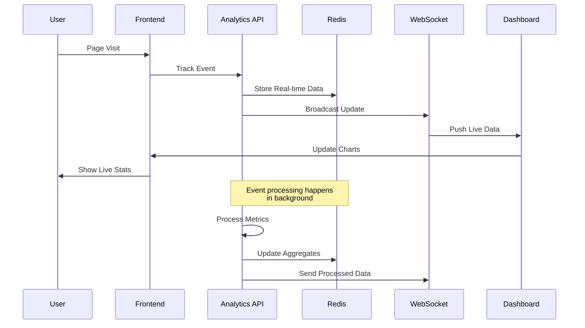

---

## 📝 **2. Content Management Architecture**

### **Content Management Flow:**

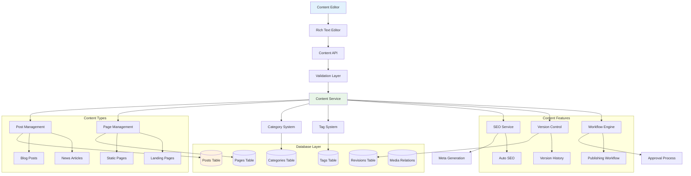

### **Content Publishing Workflow:**

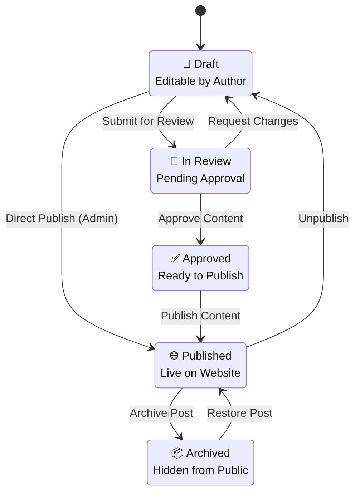

---

## 🎨 **3. Media Management Architecture**

### **Media Processing Pipeline:**

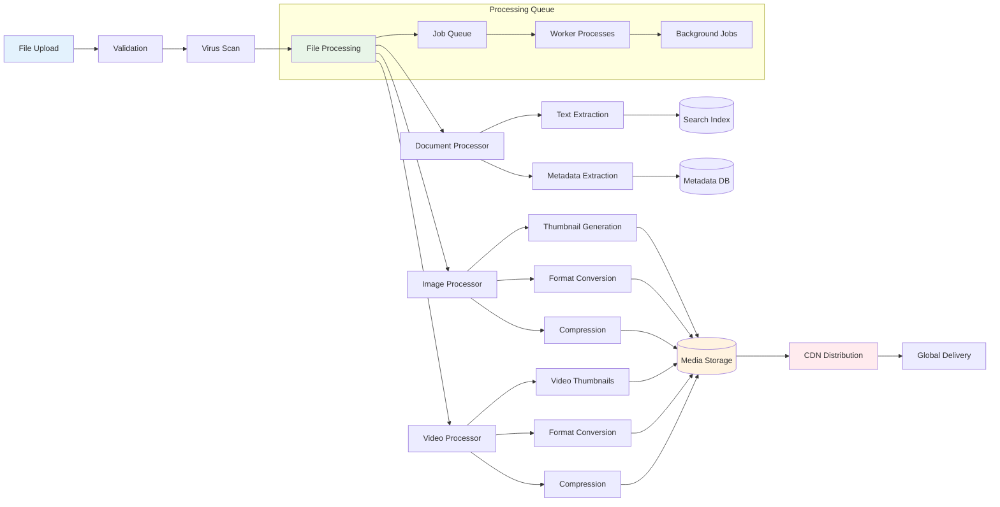

### **Media Library Organization:**

```mermaid
graph TD
    A[Media Library] --> B[Folder Structure]
    A --> C[File Management]
    A --> D[Search System]
    
    B --> E[Root Folders]
    B --> F[Nested Folders]
    B --> G[Folder Permissions]
    
    C --> H[Upload Manager]
    C --> I[Bulk Operations]
    C --> J[File Metadata]
    
    D --> K[Full-text Search]
    D --> L[Visual Search]
    D --> M[Filter System]
    
    E --> N[/images]
    E --> O[/videos]
    E --> P[/documents]
    
    N --> Q[/blog]
    N --> R[/products]
    O --> S[/tutorials]
    
    subgraph "File Types"
        T[Images: JPG, PNG, WebP]
        U[Videos: MP4, WebM]
        V[Documents: PDF, DOC]
        W[Audio: MP3, WAV]
    end
    
    subgraph "Operations"
        I --> X[Move Files]
        I --> Y[Delete Files]
        I --> Z[Tag Files]
        I --> AA[Download ZIP]
    end
    
    style A fill:#e3f2fd
    style B fill:#f3e5f5
    style C fill:#e8f5e8
    style D fill:#fff3e0
```

---

## 🎭 **4. Theme System Architecture**

### **Theme Customization Flow:**

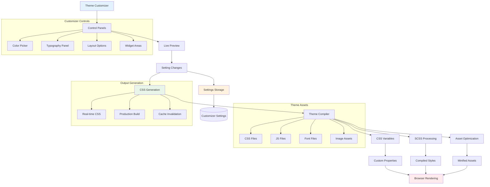

### **Theme Structure:**

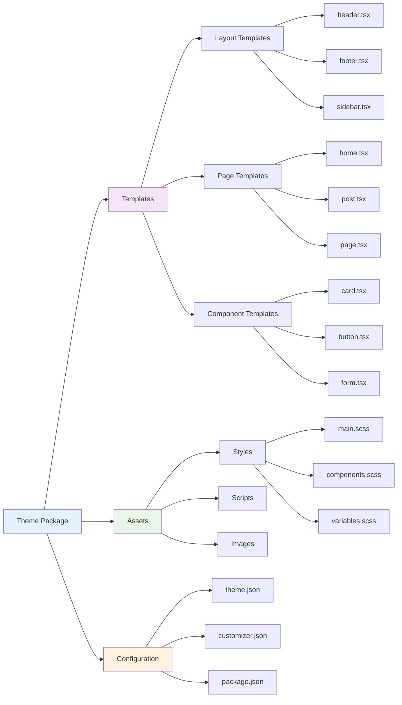

---

## 👥 **5. User Management Architecture**

### **Authentication & Authorization Flow:**

```mermaid
graph TD
    A[Login Request] --> B[Auth Middleware]
    B --> C[Credential Validation]
    C --> D[Password Verification]
    D --> E[2FA Check]
    
    E --> F[JWT Generation]
    F --> G[Session Creation]
    G --> H[User Context]
    
    H --> I[Permission Check]
    I --> J[Role Validation]
    J --> K[Resource Access]
    
    C --> L[(User Database)]
    E --> M[(2FA Storage)]
    G --> N[(Session Store)]
    I --> O[(Permissions DB)]
    
    subgraph "Authentication Methods"
        P[Email/Password]
        Q[Magic Link]
        R[OAuth (Google/GitHub)]
        S[WebAuthn]
    end
    
    subgraph "Security Features"
        T[Rate Limiting]
        U[Brute Force Protection]
        V[Account Lockout]
        W[Session Management]
    end
    
    subgraph "User Roles"
        X[Super Admin]
        Y[Admin]
        Z[Editor]
        AA[Author]
        BB[Subscriber]
    end
    
    style A fill:#e3f2fd
    style B fill:#f3e5f5
    style F fill:#e8f5e8
    style L fill:#fff3e0
```

### **Role-Based Access Control (RBAC):**

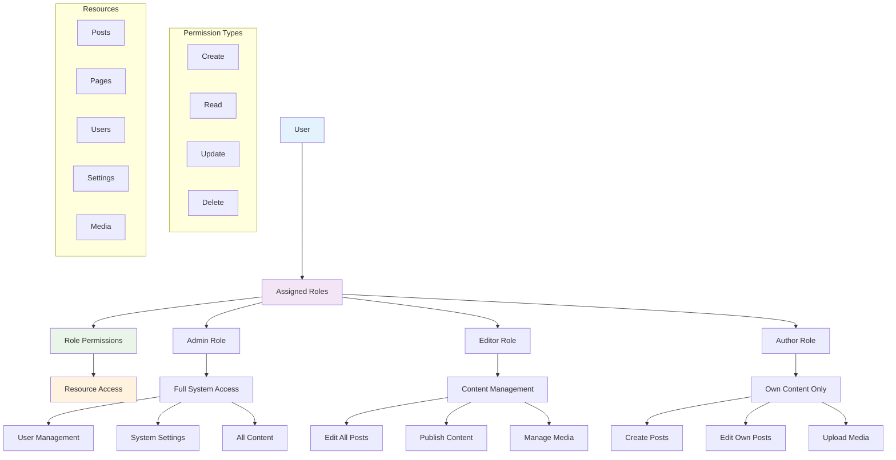

---

## 🛡️ **6. Security Monitoring Architecture**

### **Security Event Processing:**

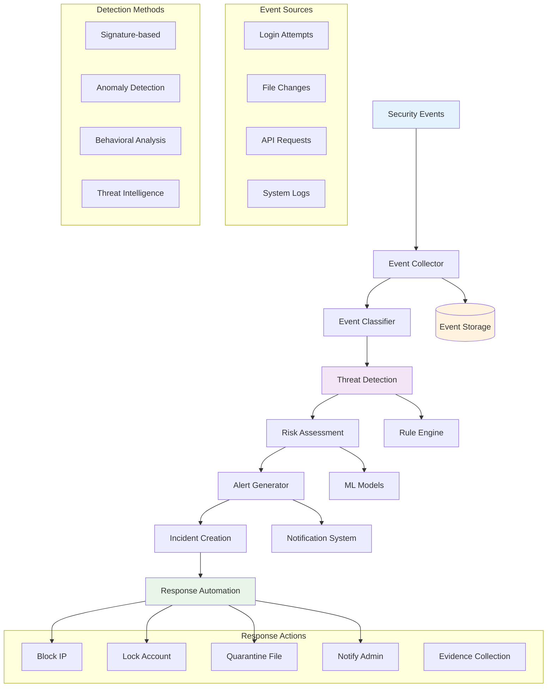

### **Security Dashboard Data Flow:**

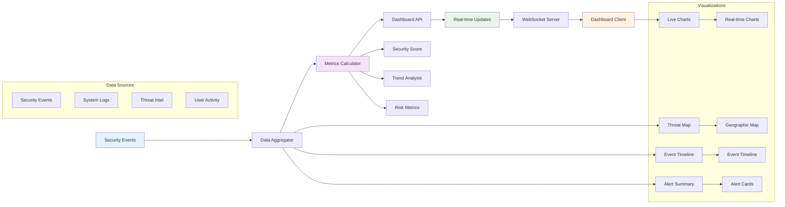

---

## ⚙️ **7. System Integration Architecture**

### **Overall System Architecture:**

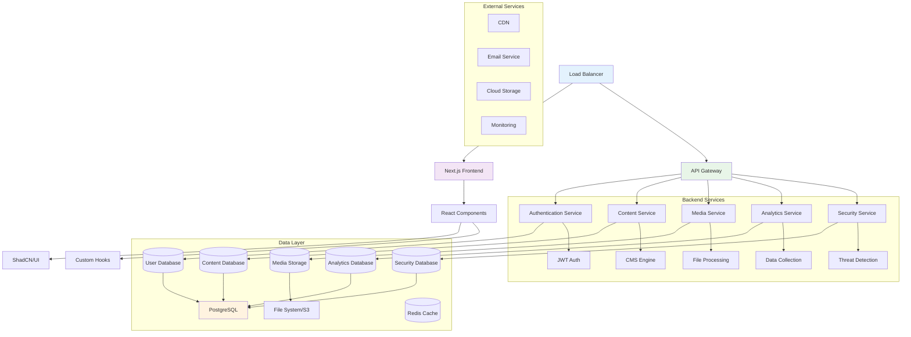

### **API Architecture:**

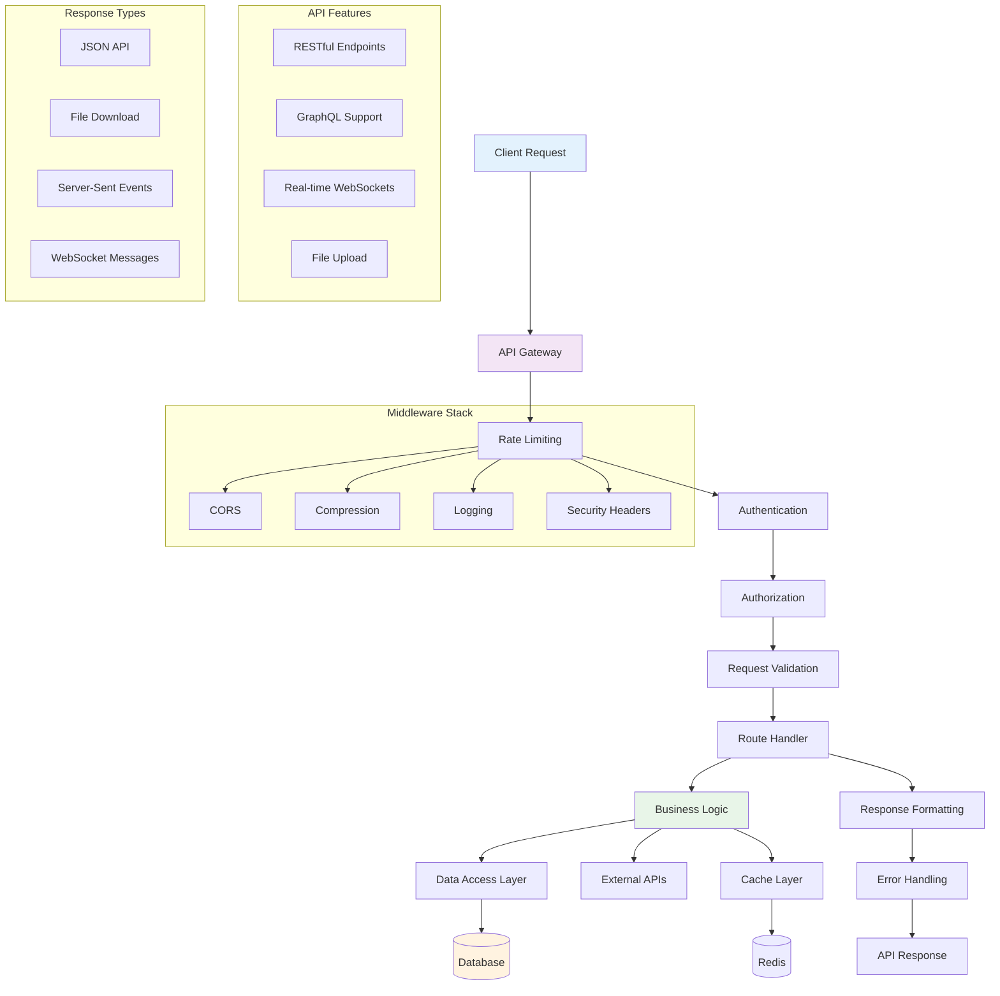

---

## 📱 **8. Frontend Architecture**

### **Next.js App Structure:**

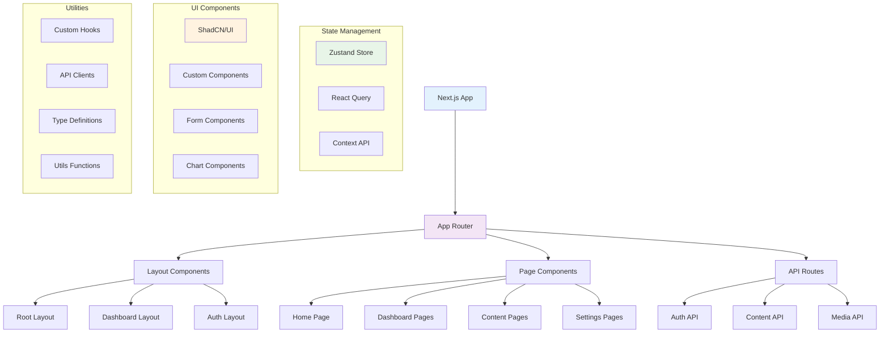

---

## 🔗 **Integration Patterns**

### **Microservices Communication:**

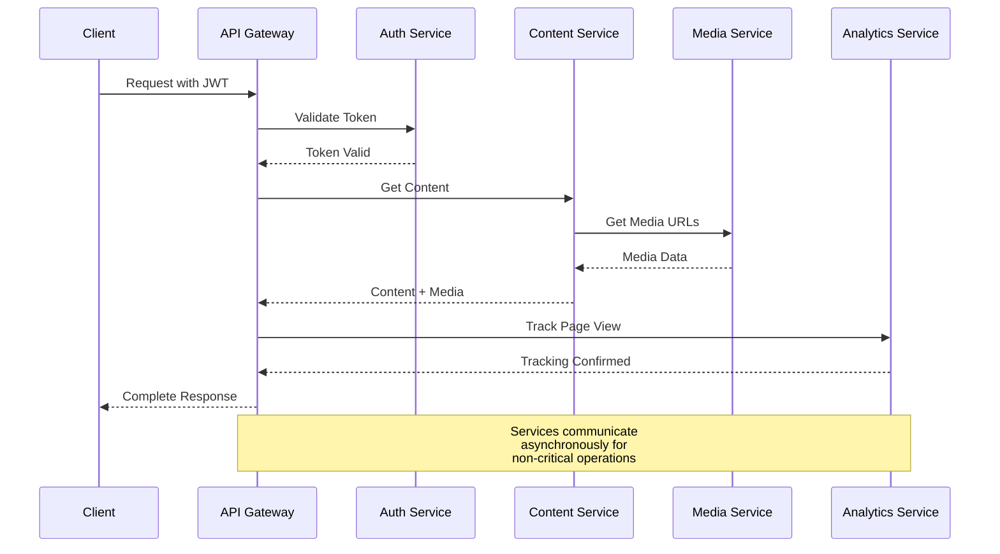

---

**Diagram Legend:**
- 🟦 **Blue**: User Interface / Frontend
- 🟪 **Purple**: API / Gateway Layer  
- 🟩 **Green**: Business Logic / Services
- 🟨 **Orange**: Data Storage / Database
- 🟥 **Red**: External Services / CDN

---

**Last Updated:** 2024-01-09  
**Version:** 2.0  
**Status:** Active

